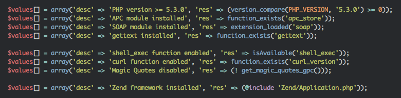
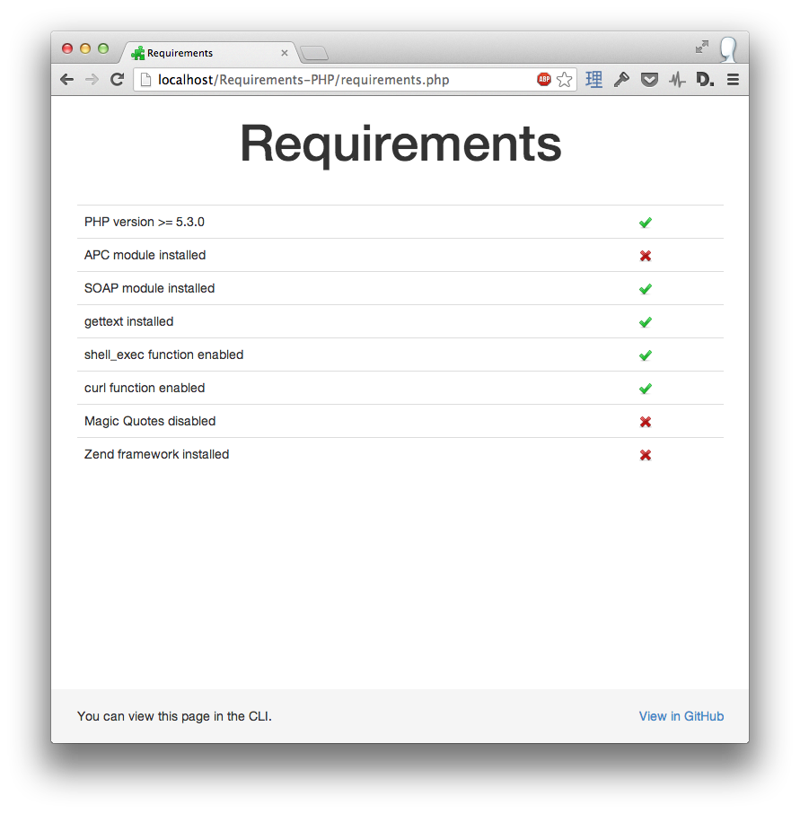
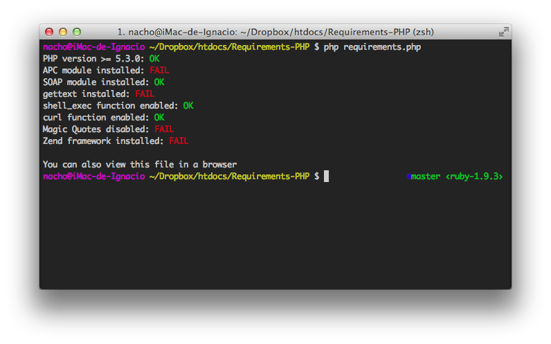

# aMember v4.x PHP Requirements

Download, unzip and upload the directory Requirements to your webhost. 

To run as a web page open http://example.com/Requirements/index.php in your browser (replace the URL as required)

All items should have a green tick, if not you have an issue with your PHP configuration. 

## Originally from a [generic checker](https://github.com/inacho/Requirements-PHP)

Configurable page to check the requirements of your PHP Application.

## Usage

### Add your own conditions

### Run file in browser

### Also works in the CLI

## License

Released under the MIT License.